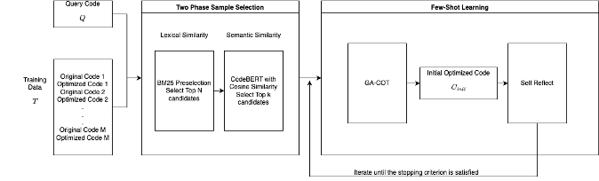

# CodeOpt: Code Optimization with Two-Stage Sampling, Few-Shot Learning, and Iterative Self-Reflection


`CodeOpt` is a cutting-edge framework for optimizing code performance using a combination of **Two-Stage Sampling**, **Few-Shot Learning**, and **Iterative Self-Reflection**. This project leverages advanced techniques such as BM25 for initial preselection, CodeBERT for semantic similarity, and Large Language Models (LLMs) for code optimization.

---

## Features
- **Two-Stage Sampling**: Combines BM25-based preselection with semantic similarity scoring.
- **Few-Shot Learning**: Incorporates representative examples for contextual optimization.
- **Iterative Self-Reflection**: Refines code iteratively to achieve improved runtime and correctness.
- **Support for Genetic Algorithm Inspired Chain-of-Thought (GA-COT)**.

---

## Installation

Follow these steps to set up the project environment:

### 1. Clone the Repository
```bash
git clone https://github.com/<your_username>/codeopt.git
cd codeopt
```

### 2. Create a Conda Environment
```bash
conda create -n codeopt python=3.10 -y
conda activate codeopt
```


### 3. Install Dependencies
Install the required Python libraries:
```bash
pip install -r requirements.txt
```

---

## Dataset and Model
Download the [dataset](https://zenodo.org/records/14096664).

Create models folder:
```bash
mkdir models
```
Download the model:
```bash
huggingface-cli download TheBloke/Mistral-7B-Instruct-v0.2-GGUF mistral-7b-instruct-v0.2.Q5_K_M.gguf
--local-dir ./models --local-dir-use-symlinks False
```
---

## Running the Project

### 1. Prepare the Input Data
- Add your input code files to the data/ directory.
- Ensure your test cases are in the tests/ directory, structured as expected by the executor.

### 2. Configuration

Modify the config.json file to set up your desired parameters:
- use_ga: Enable/disable Genetic Algorithm Inspired Chain-of-Thought (GA-COT).
- use_fewshot: Enable/disable Two-Stage Sampling and Few-Shot Learning.
- evaluation_path: Path to save the results.
- max_new_tokens: Number of tokens for LLM output.

### 3. Run the Optimization

Use the following command to run the project:
```bash
python src/main.py --config config.json
```
---

## Example Configuration

Here’s an example of config.json:
```bash
{
    "mode": "iterative",
    "train_data_path": "processed_data/python/train_split.jsonl",
    "test_data_path": "processed_data/python/test_split.jsonl",
    "test_cases_path": "processed_data/public_test_cases/",
    "model_path": "./models/mistral-7b-instruct-v0.2.Q5_K_M.gguf",
    "log_path": "./logs/mistral",
    "evaluation_path": "./evaluation/mistral",
    "batch_size": 1,
    "max_seq_length": 2048,
    "max_new_tokens": 1024,
    "temperature": 0.7,
    "use_ga": false,
    "use_fewshot": true
}
```
---

## Citation

If you use this project in your research, please cite:
```bash
@misc{codeopt2024,
  author = {Your Name},
  title = {CodeOpt: Code Optimization with Two-Stage Sampling, Few-Shot Learning, and Iterative Self-Reflection},
  year = {2024},
  howpublished = {\url{https://github.com/<your_username>/codeopt}}
}
```
---

## Acknowledgments

We acknowledge the authors of Search-Based LLMs for Code Optimization for their foundational work that inspired our methodology and approach. Their research: S. Gao, C. Gao, W. Gu, and M. Lyu, “Search-based llms for code optimization,” in 2025
IEEE/ACM 47th International Conference on Software Engineering (ICSE), pp. 254–266,
IEEE Computer Society, 2024.
